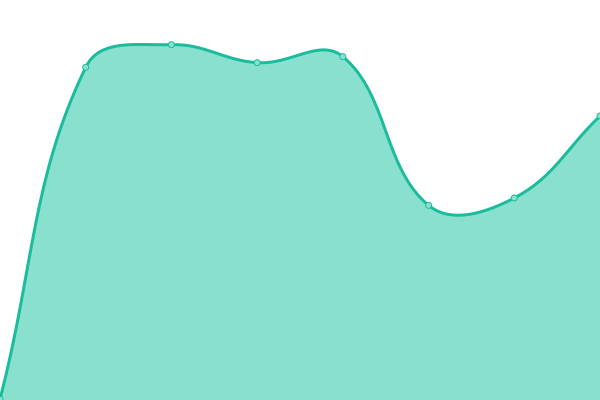

# [📈 Live Status](https://demo.upptime.js.org): <!--live status--> **🟩 All systems operational**

This repository contains the open-source uptime monitor and status page for [Nektiu-S-L](https://demo.upptime.js.org), powered by [Upptime](https://github.com/upptime/upptime).

With [Upptime](https://upptime.js.org), you can get your own unlimited and free uptime monitor and status page, powered entirely by a GitHub repository. We use [Issues](https://github.com/Nektiu-S-L/nektiu-products/issues) as incident reports, [Actions](https://github.com/Nektiu-S-L/nektiu-products/actions) as uptime monitors, and [Pages](https://demo.upptime.js.org) for the status page.

<!--start: status pages-->
<!-- This summary is generated by Upptime (https://github.com/upptime/upptime) -->
<!-- Do not edit this manually, your changes will be overwritten -->
<!-- prettier-ignore -->
| URL | Status | History | Response Time | Uptime |
| --- | ------ | ------- | ------------- | ------ |
|  [Atento Live](https://atentolive.com/) | 🟩 Up | [atento-live.yml](https://github.com/Nektiu-S-L/nektiu-products/commits/HEAD/history/atento-live.yml) | 

 441ms
     
 | 

<a href="https://Nektiu-S-L.github.io/nektiu-products/history/atento-live">77.95%</a>
    

|  [Streamedia](https://streamedia.io/) | 🟩 Up | [streamedia.yml](https://github.com/Nektiu-S-L/nektiu-products/commits/HEAD/history/streamedia.yml) | 

 607ms
     
 | 

<a href="https://Nektiu-S-L.github.io/nektiu-products/history/streamedia">100.00%</a>
    

|  [Sensetech](https://sensetech.io/) | 🟩 Up | [sensetech.yml](https://github.com/Nektiu-S-L/nektiu-products/commits/HEAD/history/sensetech.yml) | 

 436ms
     
 | 

<a href="https://Nektiu-S-L.github.io/nektiu-products/history/sensetech">99.70%</a>
    

|  [Certhash](https://certhash.com/) | 🟩 Up | [certhash.yml](https://github.com/Nektiu-S-L/nektiu-products/commits/HEAD/history/certhash.yml) | 

 372ms
     
 | 

<a href="https://Nektiu-S-L.github.io/nektiu-products/history/certhash">97.62%</a>
    

|  [Nektiu Website](https://nektiu.com/) | 🟩 Up | [nektiu-website.yml](https://github.com/Nektiu-S-L/nektiu-products/commits/HEAD/history/nektiu-website.yml) | 

 5369ms
     
 | 

<a href="https://Nektiu-S-L.github.io/nektiu-products/history/nektiu-website">99.90%</a>
    

<!--end: status pages-->

[**Visit our status website →**](https://demo.upptime.js.org)

## 📄 License

- Powered by: [Upptime](https://github.com/upptime/upptime)
- Code: [MIT](./LICENSE) © [Nektiu-S-L](https://demo.upptime.js.org)
- Data in the `./history` directory: [Open Database License](https://opendatacommons.org/licenses/odbl/1-0/)
